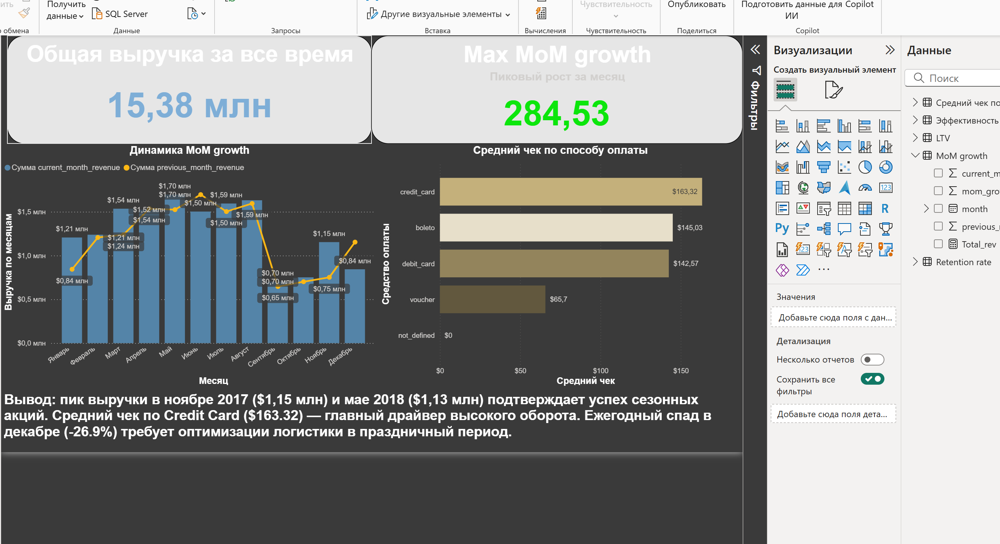
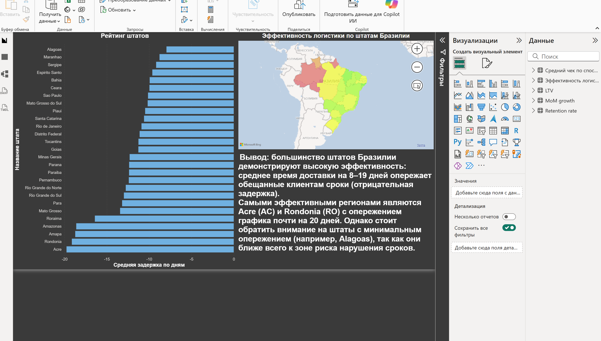
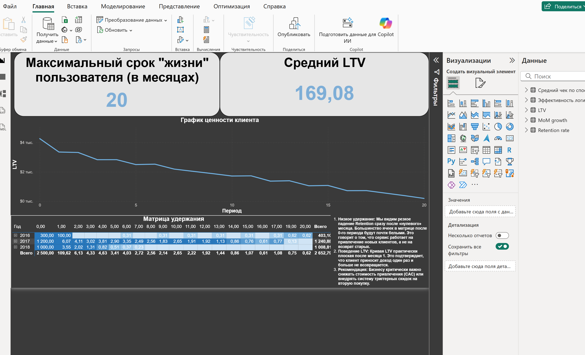

# Анализ маркетплейса Olist (Бразилия)

## О проекте
В данном репозитории представлен комплексный анализ данных крупнейшего бразильского маркетплейса Olist. Проект охватывает путь от обработки сырых данных с помощью SQL до построения интерактивного бизнес-дашборда в Power BI.

Цель проекта: Оценить динамику роста выручки, выявить проблемные зоны в логистике, проанализировать продуктовые метрики, такие как  Retention rate (удержание клиентов) и LTV для принятия управленческих решений.

---

## Технический стек
* Базы данных: PostgreSQL (сложные аналитические запросы, CTE, Window Functions).
* Визуализация: Power BI (DAX, создание связей, интерактивное картографирование).

---

## Структура проекта
* /sql - SQL-скрипты для расчета ключевых метрик.
* /dashboard - файл отчета Power BI (.pbix).
* /images - скриншоты дашборда для документации.
* /data - датасет Olist

---

## Ключевые этапы и выводы

### 1. Финансовые показатели (Sales & Payments)
  * Фаза взрывного роста: В начале 2017 года произошел запуск основной деятельности, что привело к росту выручки с $127 тыс. до $414 тыс. за первый квартал (средний MoM +82%).
 * Пиковые показатели: Максимальная выручка зафиксирована в ноябре 2017 ($1,15 млн) и мае 2018 ($1,13 млн), что подтверждает успех сезонных промо-акций (Например, Черная пятница).
 * Драйвер эффективности: Рост выручки напрямую связан с высокой долей оплаты Credit Card, так как этот метод обеспечивает самый высокий средний чек — $163.32.
 * Сезонный риск: Ежегодный спад в декабре (до -26.9%) указывает на необходимость оптимизации логистики или платежных процессов в конце года.
### Страница 1: Анализ выручки

### 2. Эффективность логистики
* Надежность: Большинство штатов доставляют заказы на 8–19 дней раньше срока, что является сильным конкурентным преимуществом.
 * География: Самыми эффективными регионами являются Acre (AC) и Rondonia (RO) с опережением графика почти на 20 дней. Однако стоит обратить внимание на штаты с минимальным опережением (например, Alagoas), так как он ближе всего к зоне риска нарушения сроков.
### Страница 2: Эффективность логистики

### 3. Продуктовая аналитика (Retention & LTV)
* Низкая лояльность: Удержание клиентов (Retention) во второй месяц падает ниже 1%. Модель бизнеса — транзакционная, а не рекуррентная.
 * LTV Плато: Накопленная ценность клиента практически не растет после первого месяца, что подтверждает отсутствие повторных покупок.
 * Рекомендация: Необходим запуск CRM-маркетинга (рассылки, бонусы, кэшбэк) для удержания клиентов и снижения зависимости от дорогого привлечения (CAC).
### Страница 3: Когортный анализ (Retention)

---

## Как использовать проект
1. SQL код: Все запросы для подготовки данных находятся в папке [`/sql`](./sql).
2. Дашборд: Для просмотра интерактивного отчета скачайте файл из папки [`/dashboard`](./dashboard) и откройте в Power BI Desktop.
3. Данные: Проект базируется на публичном датасете Olist с Kaggle ['/data'](./data)
